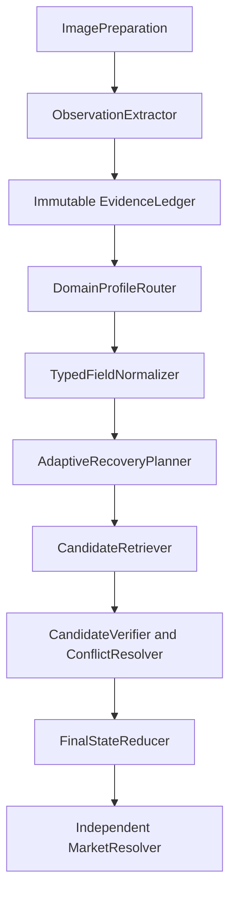

# FlipCheck v1.32 — Universal Identity Engine V2

## Production route

`IdentificationEngine` delegates every identification to `UniversalIdentityEngineV2` before any legacy route. The v1.32 route is:

The reducer is called once. `EvidencePolicy` and the legacy recognition ladder may still populate compatibility diagnostics, but cannot mutate a result whose `finalState` was produced by the v1.32 reducer.

## Epistemic contract

Each `EvidenceAtom` is immutable and has one level:

| Level | Meaning | Required grounding |
|---|---|---|
| `OBSERVED` | Visible text, logo, code, symbol, finish, or physical layout | Image index and a specific region or derived crop |
| `INFERRED` | Visual hypothesis or unlocalized model interpretation | Reason/source; it cannot veto an observed or catalog fact |
| `RETRIEVED` | Official/catalog/Web result | Source URL and source authority |

If Vision emits a supposed observation without a specific image region, the ledger demotes it to `INFERRED`. Normalization appends a linked atom; it never rewrites the raw atom, its origin, or its location.

## Typed semantics

`TypedFieldNormalizerV2` separates identity data from statistics, biography, rules text, UI overlays, watermarks, and market text. In particular:

- `productReleaseYear`, `setSeason`, `statisticsSeason`, and `copyrightYear` are independent;
- `collectorNumber`, `physicalCardNumber`, `catalogCardNumber`, `graphicNumber`, `statisticsNumber`, and `physicalSerial` are independent;
- `productLine`, `commercialFormat`, `configuration`, `sku`, and `barcode` are independent;
- `model` and `productCode` are independent for electronics.

The TCG collector grammar repairs OCR confusables only in collector-number fields and only after an independent atom supports the repaired value. Alphanumeric identifiers such as `H23/H32`, `TG01/TG30`, `SWSH001`, `XY123`, and `SM-P` remain unchanged.

## Adaptive recovery

The planner evaluates the first missing critical discriminator for the active profile and chooses one of:

1. profile-specific local crops;
2. focused Vision over the original plus the discriminating crops;
3. one identity-only Web search with explicit candidate disproof;
4. closure at the demonstrated identity level;
5. a specific photo request when the current views cannot expose the remaining discriminator.

The Web request excludes prices and marketplace language. Market resolution is independent and is not run while identity, model, format, or SKU is materially pending.

## Hierarchical closure

`FinalStateReducerV2.reduce(...)` derives category, family, core, exact physical identity, catalog identity, variant/format/model, and market state together. A pending format, SKU, finish, edition, parallel, or model cannot downgrade a confirmed core.

`CONFLICTED` requires two reliable localized observations for the same canonical field that remain incompatible after typed normalization. Missing data, ambiguous Web text, inferred hypotheses, aliases, and catalog candidates rejected by physical evidence do not create global conflicts.

## Legacy bypass

The following legacy decision paths remain in the source only for compatibility and historical regression coverage, but are bypassed for production identity decisions:

- `IdentificationPipelineV082` and earlier pipeline versions;
- distributed closure/post-Web state patches;
- legacy catalog tournament finalization;
- legacy final-output composition after `EvidencePolicy`.

Camera, multi-image loading, background foreground-service execution, API configuration, retry accounting, cost telemetry, package name, and signing configuration remain unchanged.
